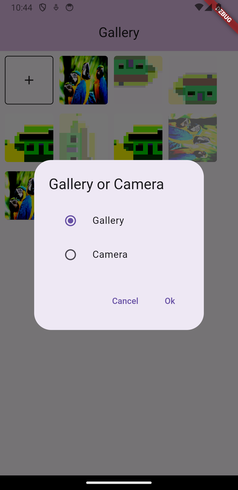
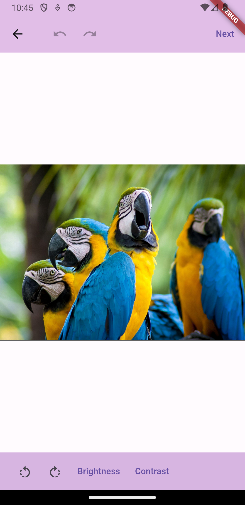
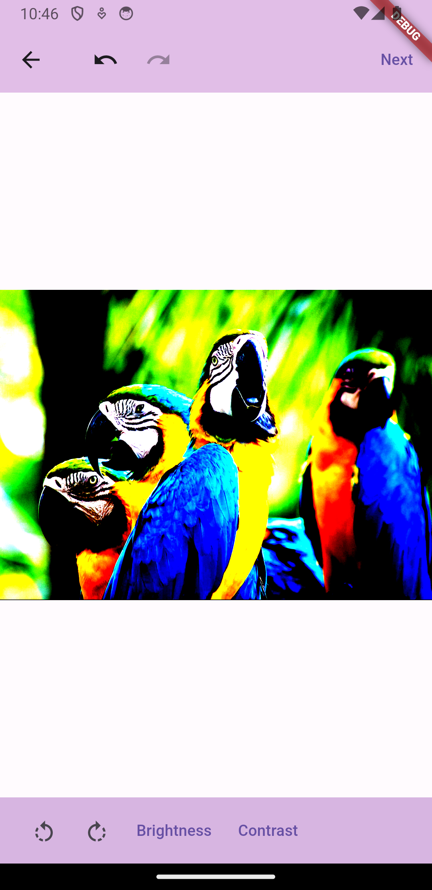
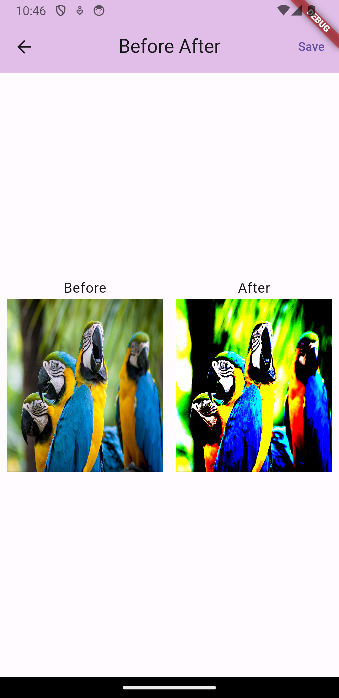

<h1>
Like Picksart
</h1>
<h3>Flutter app for Android and iOS was inspired by <a href = "https://picsart.com">Picksart</a>🙃</h3>

<h1>
Technology Stack
</h1>

|                                                                                     |                                                                                                                   |
| ------------------------------------------------------------------------------------------ | -------------------------------------------------------------------------------------------------------------------- |
| Architecture                         | BLoC Architecture with <a href="https://pub.dev/packages/elementary">Elementary</a>
| State manager               | <a href="https://pub.dev/packages/provider">Provider</a>, <a href="https://pub.dev/packages/elementary">Elementary</a>                  |
| Localization | <a href="https://docs.flutter.dev/ui/accessibility-and-internationalization/internationalization">l10n</a>      |
| Navigation         | <a href="https://pub.dev/packages/auto_route">auto_route</a>               |
| Image editing         | <a href="https://pub.dev/packages/bitmap">bitmap</a>             |
| Getting image from Gallery/Camera       | <a href = "https://pub.dev/packages/image_picker">image_picker</a>            |

<h1>
Examples
</h1>

    <table>
        <tr>
            <td style="text-align: center">
                
            </td>            
            <td style="text-align: center">
                
            </td>
            <td style="text-align: center">
                
            </td>
            <td style="text-align: center">
                
            </td>
        </tr>
        <tr>
            <td style="text-align: center">
                
            </td>
            <td style="text-align: center">
                
            </td>
            <td style="text-align: center">
        
        </td>
        </tr>
    </table>

